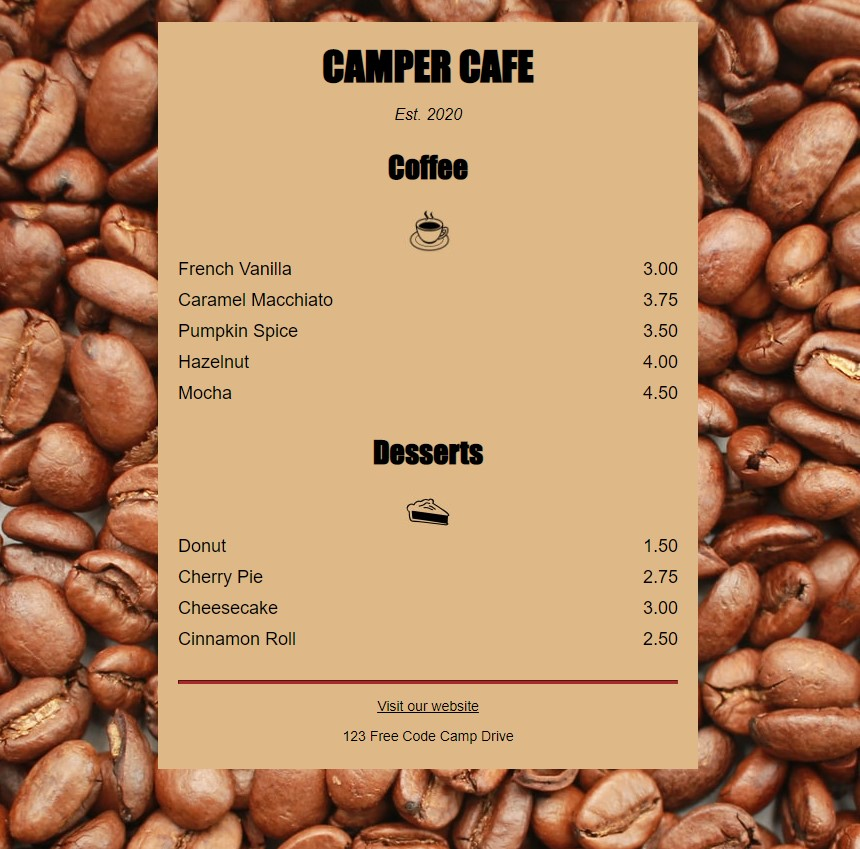

# CAMPER CAFE MENU
freeCodeCamp project

## 1. Description
freeCodeCamp project.

[DIRECT LINK](https://cbushehry.github.io/camper-cafe-menu/)

## 2. Features
 * Review code to see how to build your own similar menu page

 

## 3. Credits / Contact
This application was created by Cameron Bushehry

  
  